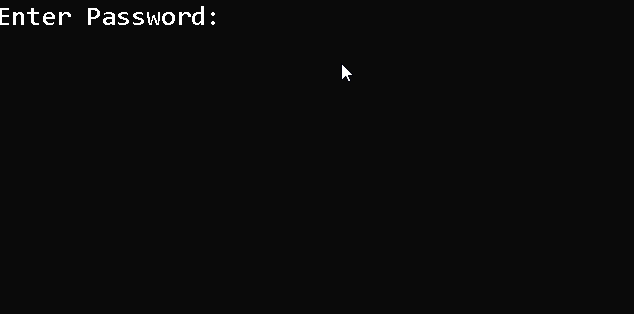

# Maskpass

Maskpass is a Python library used for asking password by masking it or not echoing it at all

### Installation

Use the package manager [pip](https://pip.pypa.io/en/stable/) to install maskpass.

```bash
pip install maskpass
```

### Usage
This module contains a single function askpass() having two optional arguments prompt and mask. The default value for prompt is `Enter Password: ` and for mask is `*`

```python
import maskpass

password=maskpass.askpass()

```


Use ` mask=""` for not echoing anything into the terminal. (Like entering sudo passwords in *nix)

The function returns the entered password in string format
### Screenshots

### Contributing
Pull requests are welcome. For major changes, please open an issue first to discuss what you would like to change.

### Issues
Currently I have only tested it in Windows 10 and Manjaro Linux, so I'm not sure it works in macOS. It doesn't work in QtConsole, Jupyter Notebook or PyCharm console.

### License
[MIT License](https://choosealicense.com/licenses/mit/)